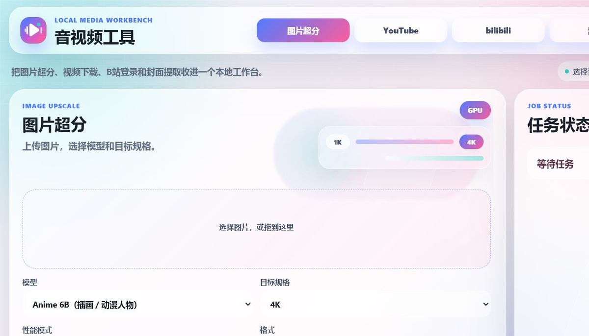
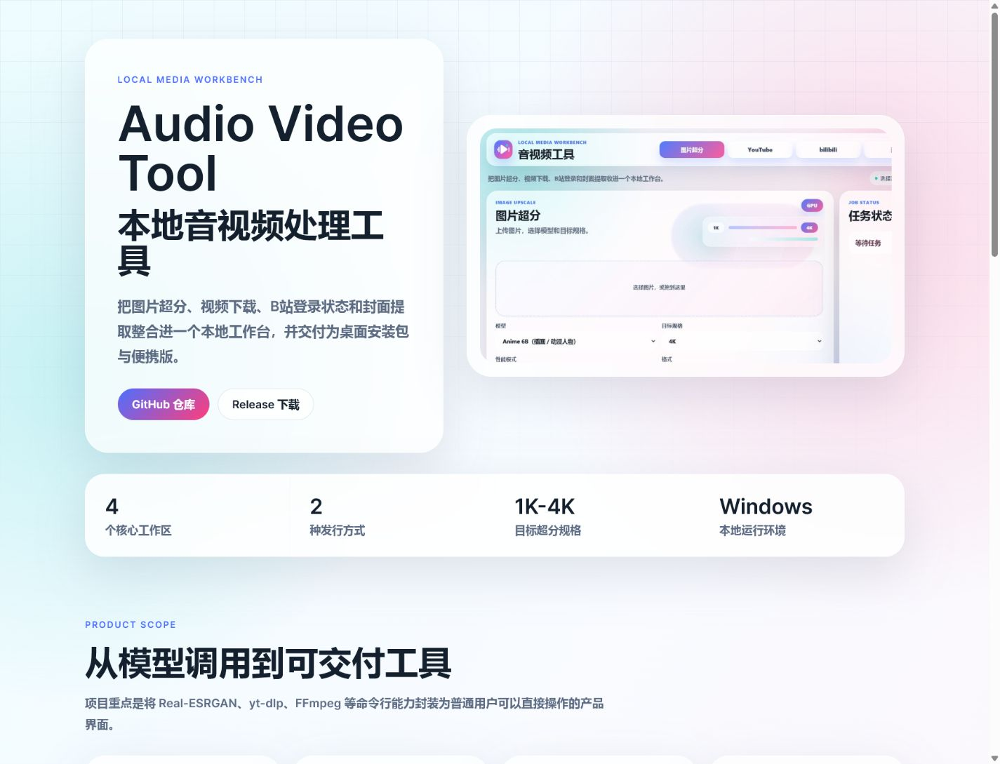
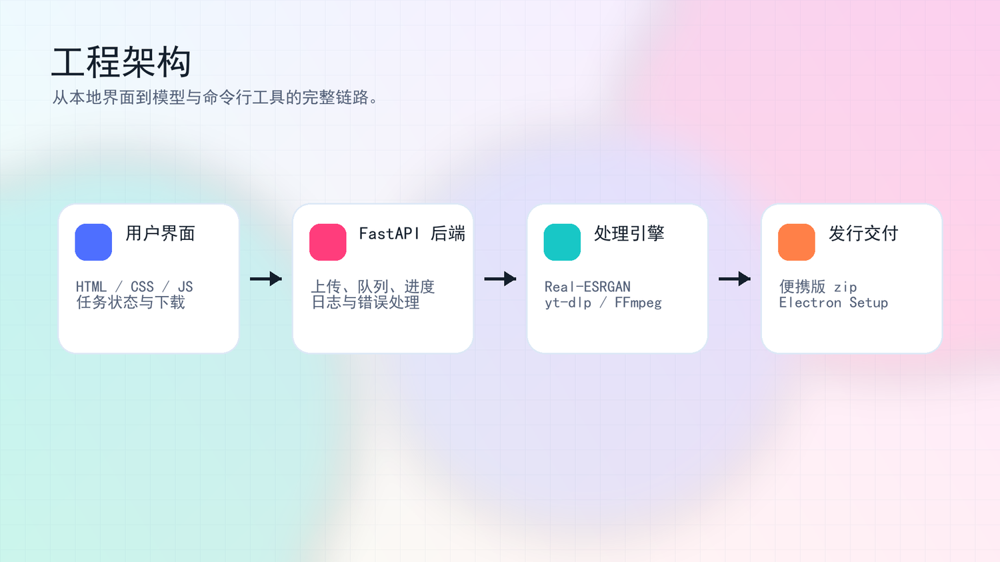

# Audio Video Tool

[中文](README.md) | [English](README.en.md) | [Live Portfolio](https://3takagi.github.io/audio-video-tool/)

Audio Video Tool is a Windows local media toolbox for image upscaling, YouTube downloads, bilibili downloads, and video thumbnail extraction. It ships as both a desktop installer and a portable zip package.



## Portfolio

The standalone project portfolio page is available at:

[https://3takagi.github.io/audio-video-tool/](https://3takagi.github.io/audio-video-tool/)

The source file is available at [docs/index.html](docs/index.html).

It presents the product scope, core workflows, before-and-after upscaling result, engineering architecture, and release deliverables.




## Download

Download from [GitHub Releases](https://github.com/3Takagi/audio-video-tool/releases/tag/v0.1.0). The current release provides two files. You only need one:

| Version | File | Best for |
| --- | --- | --- |
| Desktop installer | `AudioVideoTool-Desktop-Setup-0.1.0.exe` | Recommended for most users. Install and launch it like a normal app. |
| Portable web version | `AudioVideoTool-Portable-Python.zip` | Users who prefer a no-install, extract-and-run package. |

You do not need to download both. The desktop installer does not require the portable zip, and the portable zip does not require the installer.

## Features

- Image upscaling: Real-ESRGAN with 1K, 2K, 4K, and custom long-edge targets.
- YouTube download: yt-dlp based, highest available quality by default, with optional quality ceilings.
- bilibili download: can use local browser login state for account-available streams.
- Thumbnail download: extracts thumbnails from yt-dlp supported links.
- Job controls: progress display, pause, resume, cancel, and result download.



## Desktop Installer

Download and run:

```text
AudioVideoTool-Desktop-Setup-0.1.0.exe
```

After installation, launch `音视频工具` from the desktop shortcut or Start menu. The desktop app starts the local backend, finds an available port, and loads the correct page automatically. Users normally do not need to open a local URL manually.

## Portable Web Version

Download and extract:

```text
AudioVideoTool-Portable-Python.zip
```

Then run:

```text
start.bat
```

The command window prints the actual URL, for example:

```text
URL: http://127.0.0.1:7860/
```

`AudioVideoTool.html` is only a shortcut launcher page. It cannot start the Python backend by itself. It only finds and opens an already running local service. If it does not work, run `start.bat` first.

## First Run

The first launch prepares a local backend runtime under:

```text
%LocalAppData%\AudioVideoTool\backend
```

For example, if the Windows user name is `Tom`, the path is usually:

```text
C:\Users\Tom\AppData\Local\AudioVideoTool\backend
```

The desktop installer and portable version share this backend runtime. Once either version finishes setup, the other version reuses it and will not download everything again.

The first setup may download Python packages, PyTorch, and Real-ESRGAN model files. It can take a while and may use several GB of disk space. Later launches skip the install step when the runtime is ready.

## Ports

Internally, the tool runs a local web service such as:

```text
http://127.0.0.1:7860/
```

`127.0.0.1` means the current computer, and `7860` is the local port. If `7860` is busy, the tool automatically tries `7861`, `7862`, and so on.

The desktop app handles ports automatically. Portable users should open the URL printed in the command window.

## bilibili Login

High-quality bilibili downloads often require account login state. The tool can try to read the local browser login state or use imported cookies.

Notes:

- Keep bilibili cookies on your own computer only.
- Do not commit cookies to GitHub or share them with others.
- Without login, only lower public qualities may be available.

## FAQ

### Can I use only the setup exe?

Yes. The desktop installer includes the desktop shell and backend base resources. You do not need the portable zip.

### Can I use only the zip?

Yes. Extract it and run `start.bat`. You do not need the desktop installer.

### Why does it say dependency install is skipped?

That means the local backend runtime is already configured. This is expected.

### Why does a YouTube download fail?

Common causes include unavailable videos, region restrictions, private videos, login checks, platform request limits, or an unavailable selected quality. The current version tries to choose the best available format not above the selected quality and shows a more specific error message when possible.

### Can this be hosted as a public website?

Not recommended. YouTube / bilibili downloading involves platform terms, copyright, and account-security risks. This project is intended as a local personal tool.

## Local Development

Python 3.10 or 3.11 is recommended.

```powershell
python -m venv .venv
.\.venv\Scripts\python.exe -m pip install -r requirements.txt
.\.venv\Scripts\python.exe -m uvicorn app:app --host 127.0.0.1 --port 7860
```

Then open:

```text
http://127.0.0.1:7860/
```

## Packaging

Build the portable package:

```powershell
powershell -ExecutionPolicy Bypass -File portable\package.ps1 -IncludePython -IncludeFfmpeg
```

Build the desktop installer:

```powershell
cd desktop
npm install
npm run dist
```

The installer is generated under:

```text
dist\desktop\
```

For release convenience, keep an English-named copy:

```text
dist\AudioVideoTool-Desktop-Setup-0.1.0.exe
```

## Project Layout

- `app.py`: FastAPI backend.
- `templates/`: main web UI templates.
- `static/`: frontend scripts, styles, and logo.
- `docs/`: static portfolio page.
- `portable/`: portable launcher, installer, HTML entry page, and packaging scripts.
- `desktop/`: Electron desktop app shell.
- `dist/`: local release outputs, not committed to Git.
- `uploads/`, `outputs/`, `jobs/`, `data/`: runtime data, not committed to Git.
