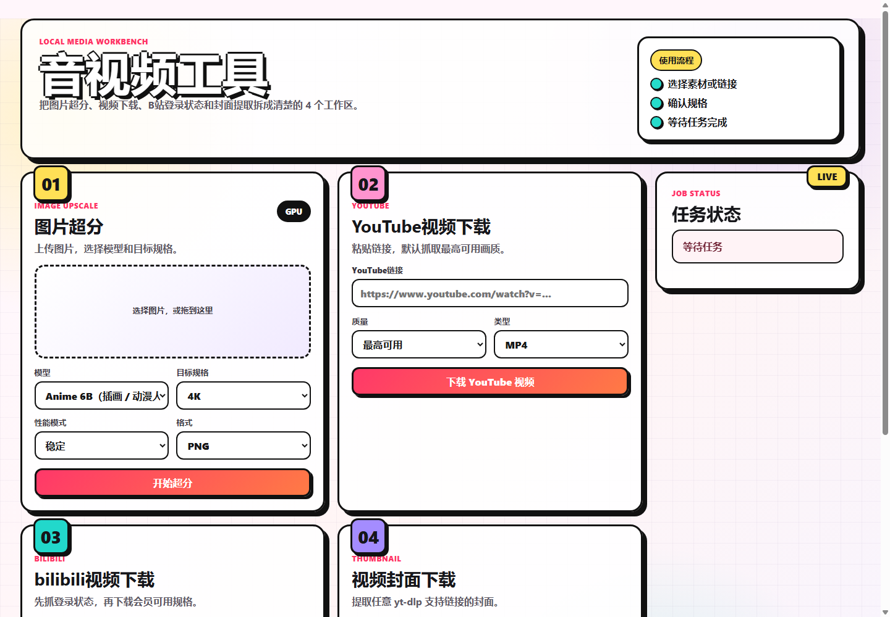

# 音视频工具

一个运行在本机浏览器里的音视频工具箱，提供图片超分、YouTube 视频下载、bilibili 视频下载和视频封面下载。



## 功能

- 图片超分：基于 Real-ESRGAN，支持 1k、2k、4k 和自定义长边。
- YouTube 视频下载：基于 yt-dlp，默认选择最高可用质量。
- bilibili 视频下载：支持通过本机浏览器登录状态获取高规格视频。
- 视频封面下载：支持常见视频链接的封面提取。
- 本地网页 UI：任务状态、进度、暂停/取消和下载入口。

## 推荐使用方式

面向普通用户时，建议下载 Release 中的便携包：

```text
AudioVideoTool-Portable-Python.zip
```

解压后双击：

```text
start.bat
```

首次运行会自动安装依赖。ZIP 本身约几十 MB，安装完成后目录通常会增长到约 5 GB，因为 PyTorch 和 Real-ESRGAN 依赖体积较大。

便携包内置 Python、Real-ESRGAN 源码、基础模型权重、FFmpeg 和 FFprobe。首次运行仍需要联网安装 PyTorch 和 Python 依赖。

## 本地开发

开发环境需要 Python 3.10 或 3.11。

```powershell
python -m venv .venv
.\.venv\Scripts\python.exe -m pip install -r requirements.txt
.\.venv\Scripts\python.exe -m uvicorn app:app --host 127.0.0.1 --port 7860
```

然后打开：

```text
http://127.0.0.1:7860/
```

图片超分需要可用的 Real-ESRGAN 环境。便携版会通过 `portable/install.ps1` 自动安装运行依赖和模型权重。

## 打包

生成轻量便携包：

```powershell
powershell -ExecutionPolicy Bypass -File portable\package.ps1 -IncludePython
```

生成完整离线包：

```powershell
powershell -ExecutionPolicy Bypass -File portable\package.ps1 -Full -MakeExe
```

完整离线包会非常大，不建议直接提交到 Git 仓库。推荐放到 GitHub Releases。

## 目录

- `app.py`：FastAPI 后端。
- `templates/`：页面模板。
- `static/`：前端脚本和样式。
- `portable/`：便携版启动、安装、瘦身和打包脚本。
- `dist/`：本地生成的发布包，不提交到 Git。
- `data/`、`uploads/`、`outputs/`、`jobs/`：运行时数据，不提交到 Git。

## 注意

- 首次安装需要联网下载 PyTorch、Python 包和模型权重。
- 便携包已内置 FFmpeg 和 FFprobe；源码开发环境可自行安装 FFmpeg。
- B站登录状态抓取需要本机安装 Chrome。
- bilibili cookies 只应保存在本机，不要提交或分享。
- 本项目定位为本机个人工具。公开视频下载功能涉及平台条款和版权风险，不建议直接部署成公网下载服务。
